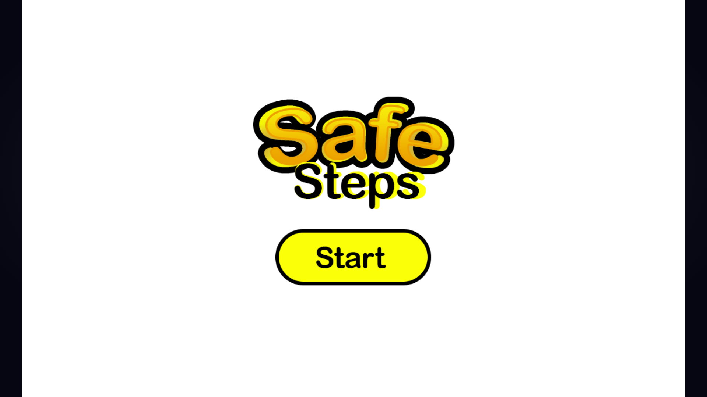
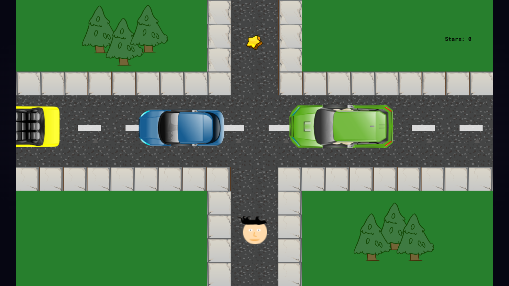
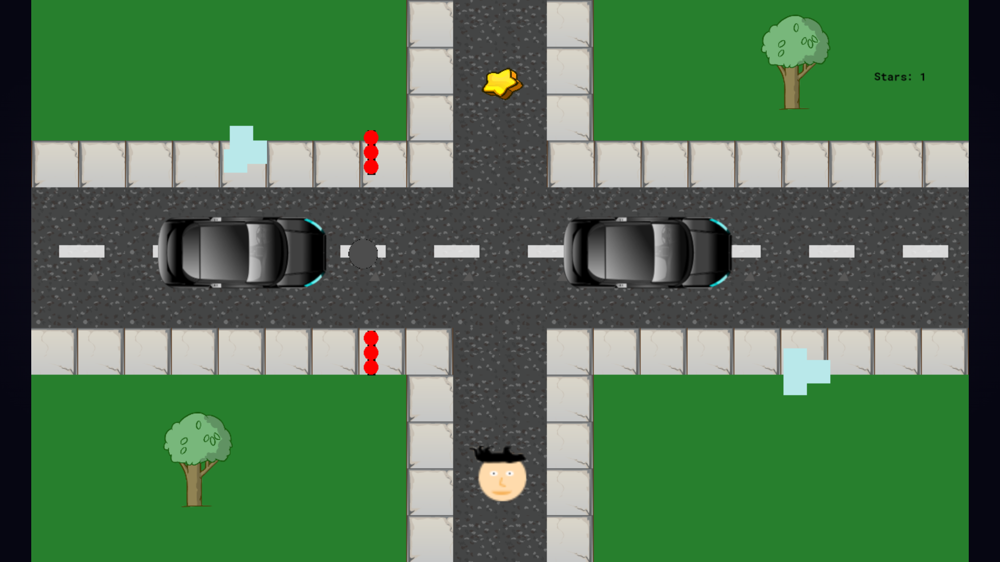
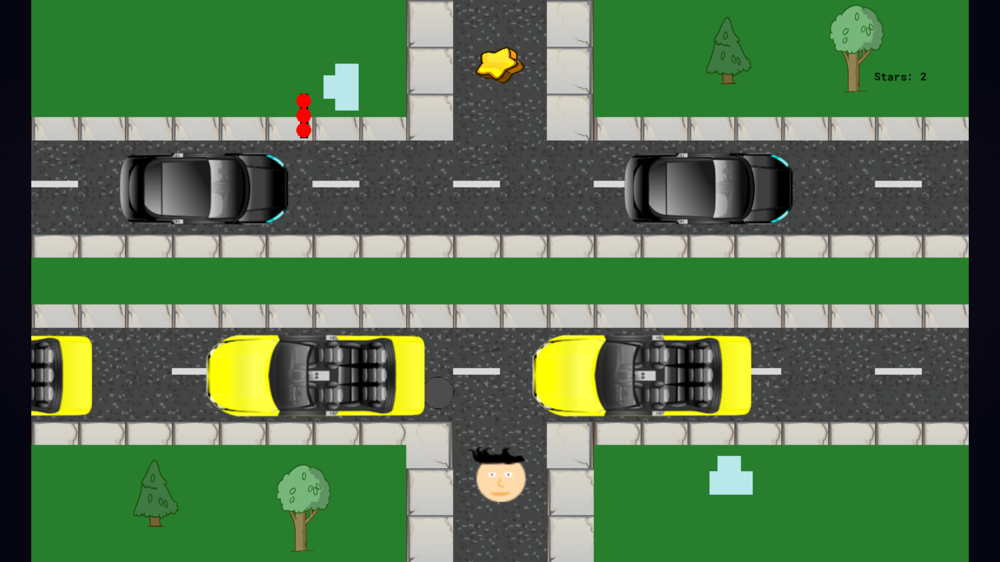

# Safe Steps
---
## Overview
Safe Steps is an engaging, educational game designed to teach players about safety protocols and best practices in various scenarios. Whether it's navigating natural disasters, traffic, or understanding basic road safety principles, Safe Steps offers an interactive learning experience to enhance safety awareness and preparedness.

## Features
- **Interactive Scenarios**: Experience realistic outcomes of various safety situations.
- **Educational Content**: Learn about safety protocols and best practices.
- **Progress Tracking**: Monitor your acheivements through the stars system.

## Screenshots




## Access Source Code On Local Devices
Follow these steps to access Safe Steps source code on your system:

1. Clone the Repository
    ```bash
    git clone https://github.com/for-i-in-rehan/Safe-Steps.git
    ```

2. Install GameMaker Studio 2
3. Open cloned repository in GameMaker Studio 2
    
## How to Play
1. **Click Start**: Click the Start button to begin the game.
2. **Navigate through the levels**: Navigate the player with WASD or Up, Down, Left and Right Keyboard Keys through the three levels of the game.
3. **Avoid hazards**: Avoid oncoming traffic, potholes and ice. Coming in contact with them will cause the player to respawn to the starting point of the level.
4. **Collect Stars**: Once you collected all three stars from the three levels you will be redirected back to the start menu where you can play the game.


## Contributing
I welcome any contributions from the community! To contribute:

1. Fork the repository.
2. Create a new branch (`git checkout -b feature/YourFeature`).
3. Make your changes.
4. Commit your changes (`git commit -m 'Add some feature'`).
5. Push to the branch (`git push origin feature/YourFeature`).
6. Open a pull request.

## License
This project is licensed under the MIT License. See the [LICENSE](LICENSE) file for more details.

## Contact
For questions, feedback, or support, please contact me at [rehanhh285@gmail.com](mailto:rehanhh285@gmail.com).

## Access Game
https://gx.games/games/e4hcbz/safe-steps/tracks/2b795a04-693e-4250-943c-060991081cd7 


